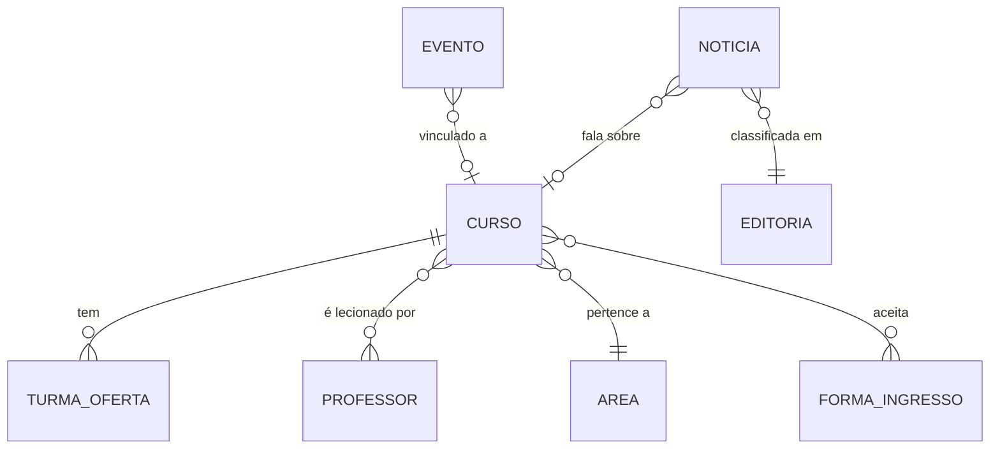

# Redesign do site WordPress da Florence
## Fase 1: Arquitetura de Informação e Modelo de Dados

Documento para aprovação. Nenhuma alteração foi feita no site. Ambiente de trabalho: `florence.luanfelipe.com.br` (teste).

---

## 1. Achados críticos

O levantamento no banco revelou três problemas estruturais que explicam por que o admin é confuso hoje.

### 1.1 O mesmo objeto foi modelado como sete tipos diferentes

Estes tipos de conteúdo têm **exatamente os mesmos campos** (`sobre-o-curso`, `duracao`, `investimento`, `matriz-curricular`, `link-de-inscricao`, `curriculo-lattes`):

| Tipo atual | Registros |
|---|---|
| `pos-graduacao` | 30 |
| `minicurso` | 25 |
| `curso-livre-30-hora` | 21 |
| `curso-livre-40-hora` | 12 |
| `curso-livre-20-hora` | 10 |
| Qualificação / Capacitação | (menus próprios) |
| Graduação e Técnico | **páginas soltas**, fora do modelo |

São todos **cursos**. "20 horas", "30 horas" e "40 horas" não são tipos de conteúdo: são o **valor de um campo** (carga horária). O mesmo vale para "pós" e "minicurso", que são o valor do campo nível.

**Consequência prática hoje:** para publicar um curso, a equipe precisa adivinhar em qual dos sete lugares ele mora. E graduação e técnico, os cursos mais importantes comercialmente, nem estão estruturados: são páginas avulsas.

### 1.2 Professores duplicados por modalidade

`corpo-docente-grad` (162) e `corpo-docenteead` (30) são o mesmo objeto **Professor**, separados por um atributo (presencial/EAD). Um professor que dá aula nos dois cadastros vira dois registros.

### 1.3 O site é, na prática, dois sites duplicados

Existem páginas espelhadas para a marca Técnico: "Nossa História" **e** "Nossa História Técnico", "Sala de Imprensa" **e** "Sala de Imprensa Técnico", "Quem Somos Técnico", "Missão Visão Valores Técnico". O tema resolve isso com **3 headers PHP diferentes** e **29 locais de menu** cadastrados.

Some-se a isso as páginas de campanha duplicadas por ciclo: `Vestibular24`, `Vestibular25`, `Medicina 25.1`, `Medicina 26`, `Medicina 26.1`, `Medicina Detalhes`, `Medicina Detalhes 25-1`. A cada semestre nasce uma página nova em vez de atualizar a existente.

### 1.4 Taxonomia de notícias mistura dois eixos

As categorias hoje misturam **assunto** (Notícias Gerais, Datas Comemorativas, Bolsas e Financiamentos, FIES) com **curso/área** (Enfermagem, Direito, Odontologia, Farmácia). Além disso, 759 posts estão em "Sem categoria".

---

## 2. Modelo de dados proposto

De ~10 tipos fragmentados para **5 objetos reais**.

### Objeto 1: Curso
Unifica graduação, técnico, pós, livres, minicursos, qualificação e capacitação.

| Campo | Tipo | Observação |
|---|---|---|
| Nome, Descrição, Imagem | básico | |
| **Nível** | seleção | Graduação, Técnico, Pós, Livre, Minicurso, Qualificação, Capacitação |
| **Marca** | seleção | Centro Universitário / Instituto (Técnico) |
| **Modalidade** | seleção | Presencial, EAD, Híbrido |
| Carga horária | número | substitui os CPTs 20/30/40h |
| Duração, Investimento | texto | já existem hoje |
| Matriz curricular | arquivo/texto | já existe |
| Link de inscrição | URL | já existe |
| Autorização/Reconhecimento MEC | texto | já existe |
| Área | relação | ver objeto 5 |
| Professores | relação | substitui campo solto |

**Ganho no admin:** um único menu "Cursos", com filtros por nível e marca. A equipe cadastra sempre no mesmo lugar, do mesmo jeito.

### Objeto 2: Professor
Fusão de `corpo-docente-grad` + `corpo-docenteead`. Campos: nome, foto, titulação, currículo Lattes, **modalidade** (atributo, não tipo), cursos em que leciona.

### Objeto 3: Evento
Objeto legítimo e distinto (campos próprios: data início/fim, tipo, sobre, destaque na home). Mantém-se, apenas migrado de Toolset para ACF.

### Objeto 4: Notícia
Post nativo do WordPress, com a taxonomia **separada em dois eixos**:
- **Editoria** (assunto): Institucional, Bolsas e Financiamentos, Datas Comemorativas, Vestibular...
- **Curso/Área** (relação): Enfermagem, Direito, Odontologia...

Isso permite, sem esforço, a página de um curso puxar automaticamente as notícias dele.

### Objeto 5: Área
Agrupador (Saúde, Sociais e Gestão, Odontologia...). Alimenta navegação e filtros.

### Forma de Ingresso: manter, com ressalva
São 8 registros (Vestibular, ENEM, Transferência, Segunda Graduação...). É objeto real (instanciável, estruturado, útil e reaproveitado entre cursos), mas é **fino**. Proposta: manter como objeto simples e relacioná-lo ao Curso. Se na Fase 2 ele não sustentar página própria, vira campo.

### O que deixa de existir
- Os 3 CPTs de curso livre por carga horária
- O CPT separado de docente EAD
- Dependência do **Toolset (licença expirada)**
- Páginas institucionais duplicadas "X Técnico" (viram uma página com a marca como atributo)

---

## 3. Arquitetura de informação

### Problema
29 locais de menu cadastrados no tema, vários redundantes ("Links Úteis Graduação", "Links Úteis PósGraduação", "Links Úteis Cursos Técnicos"...) e alguns **vazios**.

### Proposta: 2 marcas, 1 sistema
Em vez de 3 headers PHP e 29 menus, o Theme Builder do Elementor monta **2 variações de header** (Centro Universitário / Instituto Técnico) consumindo uma estrutura enxuta:

| Menu | Papel |
|---|---|
| Principal (por marca) | Institucional, Cursos, Ingresso, Notícias, Contato |
| Rodapé institucional | links legais e de transparência |
| Rodapé serviços | AVA, portal do aluno, biblioteca, ouvidoria |
| Utilitário (topo) | redes sociais, WhatsApp, portais |

**De 29 para 4 menus mantidos manualmente.** As listagens de curso deixam de ser menu manual e passam a ser **automáticas** (o Loop do Elementor lê o objeto Curso). Hoje, incluir um curso exige cadastrar o conteúdo **e** editar o menu à mão. Depois, basta publicar o curso.

### Páginas de campanha
Vestibular e Medicina passam a ser **uma página cada, atualizada por ciclo**, em vez de uma nova por semestre. Histórico preservado por rascunho/revisão.

---

## 4. Templates-chave (escopo da fase de design)

Priorizados por impacto comercial:

1. **Home** (Centro Universitário)
2. **Home Instituto/Técnico**
3. **Listagem de cursos** (com filtro por nível/área)
4. **Curso** (single) — o mais importante para conversão
5. **Captação/Vestibular** (campanha)
6. **Institucional** (padrão para as ~40 páginas internas)
7. **Notícias** (arquivo)
8. **Notícia** (single)
9. **Evento** (single + listagem)
10. **Professor/Corpo docente**
11. **Contato / Unidades**
12. **Busca e 404**

Todo template de página passa por `/copywriting` (copy com tom de vendas e CTA claro) e `/impeccable` (design).

---

## 5. Plano de migração (Toolset → ACF), sem perder dados

Executado no ambiente de teste, com backup antes de cada passo:

1. Criar os objetos novos (CPT + ACF) **em paralelo**, sem tocar no Toolset.
2. Script de migração copia `wpcf-*` para os campos ACF, com **mapa de-para** e relatório de divergências.
3. Validar amostra (10 cursos de níveis diferentes) comparando campo a campo.
4. Migrar os registros restantes; conferir contagens (30 pós, 25 minicursos, 43 livres, 192 professores, 208 eventos).
5. Redirecionar URLs antigas (301) para as novas, preservando SEO.
6. Só então desativar o Toolset.

**Risco controlado:** o Toolset permanece intacto até a validação passar. Nada é apagado antes da conferência.

---

## 6. Skills e agentes por fase

Avaliação de onde as ferramentas disponíveis melhoram o resultado:

| Fase | Skill/Agente | Por quê |
|---|---|---|
| 1. IA e dados (esta) | `layers-conceptual-model` ✅ usada | Disciplina de objetos/instâncias; foi o que expôs os 7 CPTs redundantes |
| 2. Design system | `/impeccable`, `frontend-design`, `ui-ux-pro-max` | Direção visual, tokens, tipografia, componentes |
| 2. Copy | `/copywriting` | Copy de venda, headlines e CTA por template |
| 3. Fundação | `ecc:php-reviewer`, `ecc:database-reviewer` | Revisar tema e script de migração antes de rodar |
| 4. Templates | `/impeccable` + `/copywriting` por página | Padrão definido por você |
| 5. QA | `ecc:accessibility` / `a11y-architect`, `ecc:seo-specialist`, `web-design-guidelines` | Acessibilidade (exigência de instituição de ensino), SEO na troca de URLs, checagem responsiva |
| 6. Publicação | `ecc:security-reviewer` | Varredura antes de subir para o domínio oficial |

Observação: SEO merece atenção real na Fase 5. O site tem **4.178 posts** indexados; mudar estrutura de URL sem plano de redirecionamento derruba tráfego orgânico.

---

## 7. Decisões tomadas (aprovadas em 29/07/2026)

1. **Marcas:** ✅ Centro Universitário e Instituto (Técnico) seguem no **mesmo site, sem páginas duplicadas**. Cada página institucional existe uma única vez; a marca é um atributo que muda a apresentação.
2. **Cursos de graduação e técnico:** ✅ **viram ficha padronizada**, no mesmo cadastro dos demais cursos.
3. **Notícias:** ✅ **separar assunto de curso/área** em duas classificações, e tratar os 759 posts sem categoria de forma gradual.
4. **Páginas de campanha:** ✅ **uma página por tema** (Vestibular, Medicina), atualizada a cada ciclo.
5. **Licença Elementor Pro:** decisão adiada para a fase de publicação. Pro Elements aprovado apenas para o ambiente de teste.

---

## 8. Riscos registrados

| Risco | Mitigação |
|---|---|
| Perda de dados na migração Toolset → ACF | Migração paralela + validação por amostra antes de desativar |
| Queda de tráfego orgânico | Mapa de redirecionamento 301 e auditoria SEO na Fase 5 |
| Elementor Pro sem licença oficial em produção | Levar decisão ao cliente antes da publicação |
| Equipe do cliente resistir ao admin novo | Um paradigma só, campos guiados e um guia curto de uso na entrega |
| Cache do Cloudflare mascarar mudanças | Purge na publicação de cada fase |
